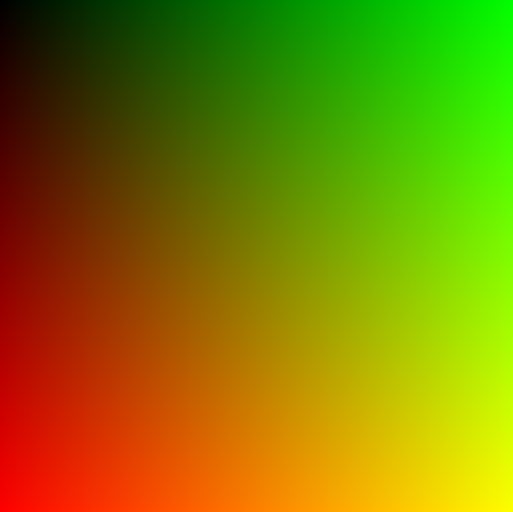

# Part 1: Data, Types, Variables

So, you are interested in building a path tracer. Let me show you how.

## Humble Beginnings

Everyone starts _somewhere_. I think it is most helpful if a guide like this started from _nowhere_.

But I am going to assume that you know how to use a computer as well as a text editor program,
if that is okay with you.

If you are completely new to this and don't know which text editor to use, I'd recommend VS Code. Make sure to install the rust-analyzer extension.

Also make sure that you have a working Rust compiler and Cargo installed. The easiest way to test this is by issuing the following command on a terminal:
(To execute a command on the terminal, type the command or paste it in, and press enter/return.)

```
cargo --version
```

And it should return something like `cargo 1.82.0`. If it doesn't, then you need to install Rust.

### Hello, world!

You'll need a folder to store programming projects. Mine is called `develop` but you can create your own names.

Create a folder if you haven't already, then open a terminal at that folder. 

If you are on Windows, here's a [guide](https://johnwargo.com/posts/2024/launch-windows-terminal/) on how to open a terminal from your folder.

If you are on MacOS, follow [these instructions](https://apple.stackexchange.com/a/438999).

After you have opened a terminal, you should see a black box that has text which includes your folder name.

Type in the command `cargo new rtir` to create a new Rust project. Press enter/return to execute the command.

If successful, you should see the following:

```
    Creating binary (application) `rtir` package
```

You are now ready to open this project in VS Code. First, open Visual Studio Code, then go to "File > Open Folder",
then select the `rtir` folder that just got created.

If your project has loaded successfully, you can see "⏵Run | Debug" at the top of your `fn main` function. We are not
going to use those buttons, and you will use the integrated terminal in VS Code instead. If you don't have a terminal on your VS Code,
go to "View > Terminal" to open it. You can drag to resize the terminal at any time you want.

Next, within the VSCode terminal, type in `cargo run`. You should see "Hello, world!", with similar output for the rest:

```
   Compiling rtir v0.1.0 (/home/beef/develop/rtir)
    Finished `dev` profile [unoptimized + debuginfo] target(s) in 0.06s
     Running `target/debug/rtir`
Hello, world!
```

Now you are ready to start writing code.

### A simple image generator

To get on with actual business, you need to remove the `println!("Hello, world!");` line.
After removing it, the entire file should look like this:

```rust
fn main() {
}
```

Let's first add some variables. We'll define the number of pixels in each row and each column.
Let's name them `image_width` and `image_height`:

```rust
fn main() {
    let image_height = 256;
    let image_width = 256;
}
```

By default, their types are going to be `i32`. We don't need to write down the types explicitly,
since `i32` works in our case for now.

Next, we're going to work with the PPM image format. It is the easiest image format out there where
you can just write to an image through printing numbers. Let's get it started!

```rust
fn main() {
    let image_height = 256;
    let image_width = 256;

    println!("P3");
    println!("{image_width} {image_height}");
    println!("255");
}
```

The "P3" specifies the format: three numbers on each line, red, green, blue. Then we print the dimensions of the image.
The "255" on the third line tells image processors that the maximum value for each channel is 255 (255 for red is the most red, 0 is the least red).

Next, we can add for loops that loop over each row and column of the pixel. Keep all the previous lines, add the following lines: (ignore the `-snip-`)

```rust
fn main() {
    -snip-

    for j in 0..image_height {
        for i in 0..image_width {
            let r = j * 255 / (image_height - 1);
            let g = i * 255 / (image_width - 1);
            let b = 0;

            println!("{r} {g} {b}");
        }
    }
}
```

Let me explain what each of these mean: `for j in 0..image_height` tells us that the next block will be executed for `image_height` times,
with each time `j` counting up from `0`, to `1`, to eventually `image_height - 1`. `for i in 0..image_width` is similar in that aspect.

The next three lines determines the value to use for the R, G, B channels respectively. Then it prints all three colors in one line.

Now. It is time to test your code by running it.

In the terminal, run `cargo run > image.ppm`. It will then create an image in the folder.

Install [ToyViewer](https://apps.apple.com/us/app/toyviewer/id414298354) on MacOS if you are unable to view the image format. For windows, install [GIMP](https://www.gimp.org/).

You should be able to see the following image:


